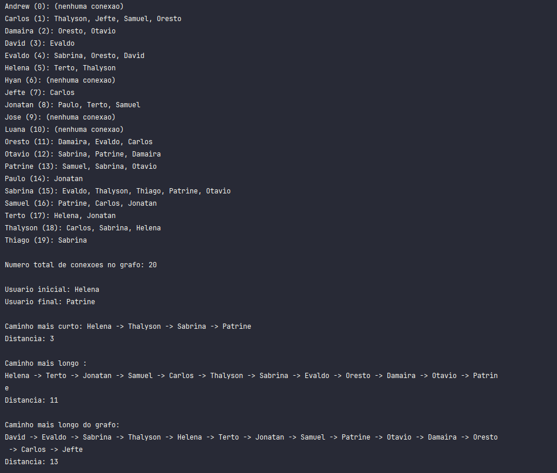
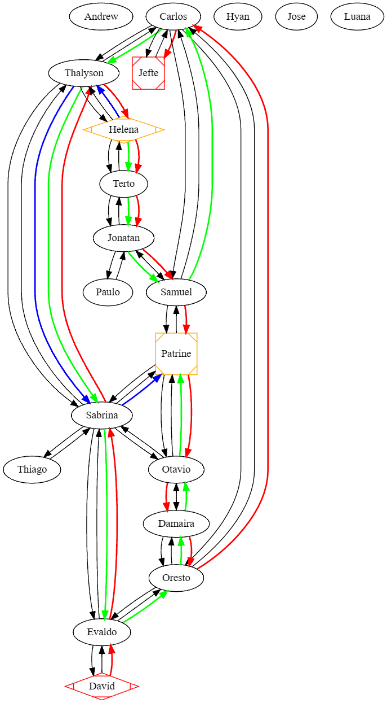
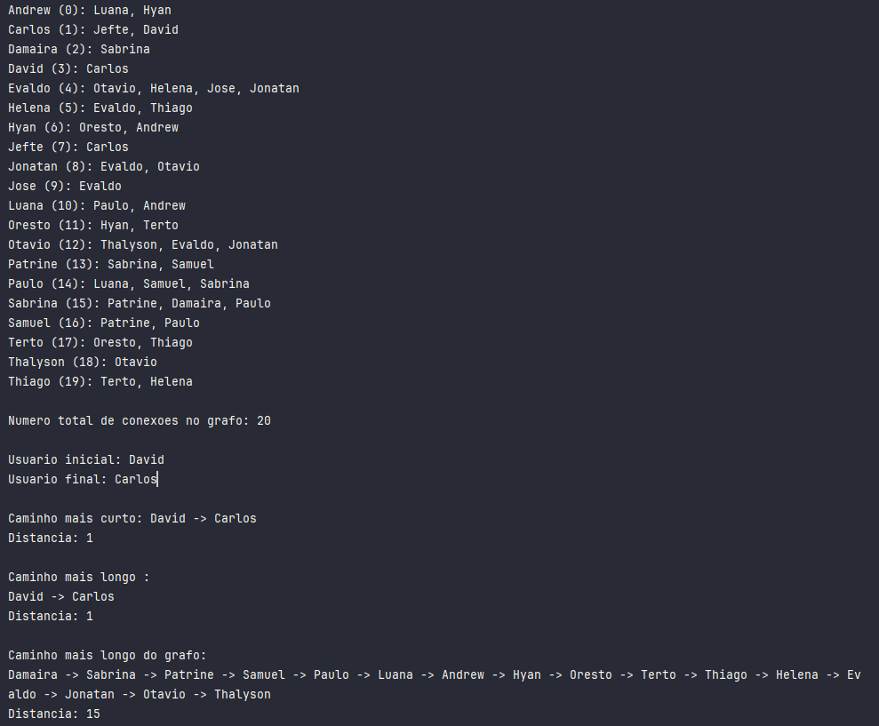
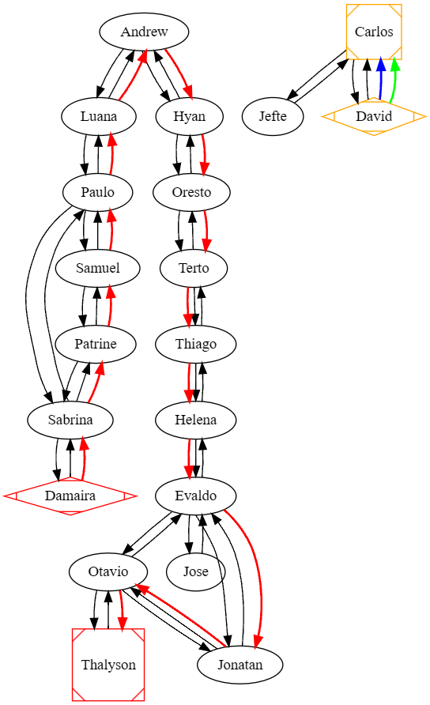
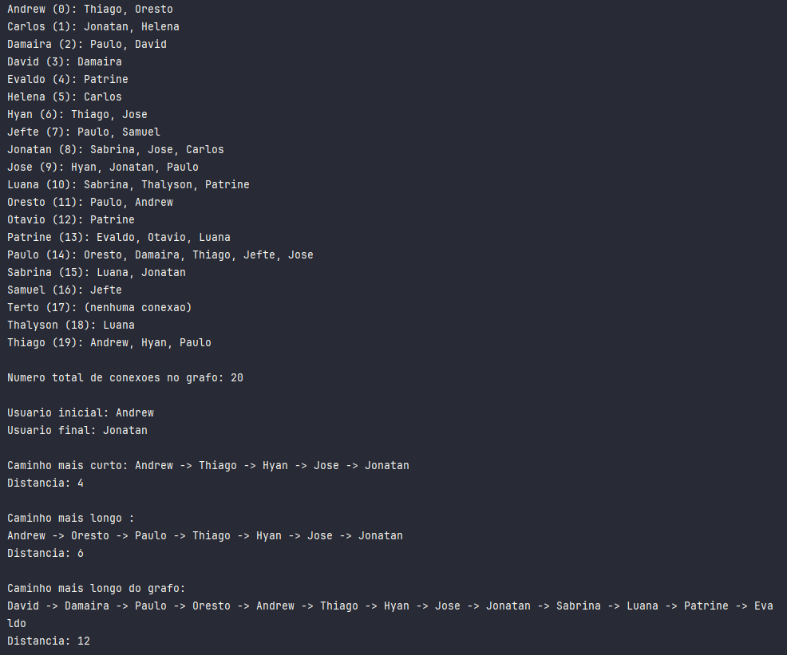
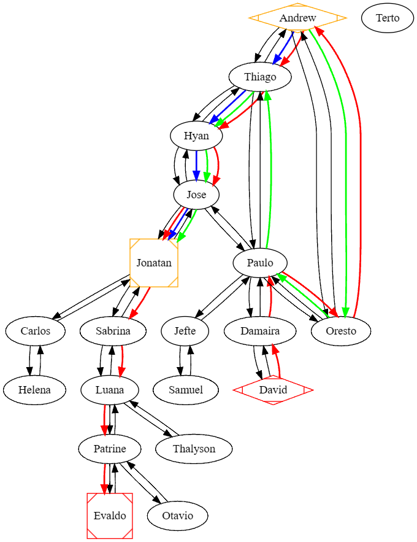

<h1>Navegação em Redes Sociais  </h1>

<h2>Contexto</h2>

Em uma rede social, como Facebook ou LinkedIn, os usuários estão conectados por amizades ou conexões profissionais.

<h2>Atividade</h2>

Implemente um algoritmo em C que utilize BFS para encontrar o menor caminho (menor número de conexões) entre dois usuários. O programa deve receber como entrada a lista de conexões e os IDs dos dois usuários e imprimir as conexões entre eles.

<h2>Objetivo</h2>

Demonstrar como BFS pode ser utilizado para encontrar a menor distância em grafos não ponderados, aplicando conceitos de redes sociais.

<h2>Requisitos Mínimos</h2>
<ul>
  <li>Sua rede deve ter no mínimo 20 usuários;</li>
  <li>As conexões devem ser geradas aleatoriamente;</li>
  <li>É preciso tratar casos em que não há conexão;</li>
  <li>Imprimir a conexão mais próxima e mais distante entre dois usuários;</li>
</ul>

<h2>Descrição do Repositório</h2>

  O código principal do projeto, totalmente desenvolvido, está disponível na branch <code>main</code>, no arquivo <code>main.c</code>. Além disso, o repositório possui outras branches que detalham o processo de desenvolvimento do código e suas funcionalidades. As branches são:
  <ul>
    <li><code>1-etapa</code>: Define a estrutura do grafo com nós representando usuários e arestas para suas conexões, utilizando listas de adjacências e identificadores únicos.</li>
    <li><code>2-etapa</code>: Conecta usuários aleatoriamente para simular interações, garantindo a ausência de auto-conexões e duplicação de arestas.</li>
    <li><code>3-etapa</code>: Utiliza BFS para encontrar e exibir o menor caminho entre dois usuários, mantendo rastros de predecessores e distâncias.</li>
    <li><code>4-etapa</code>: Implementa DFS para descobrir o caminho mais longo do grafo.</li>
    <li><code>5-etapa</code>: Implementa DFS para descobrir o caminho mais longo entre dois pontos.</li>
  </ul>

<h2>GraphvizOnline</h2>

  O resultado da execução do algoritmo foi visualizado no site <a href="https://dreampuf.github.io/GraphvizOnline/" target="_blank">GraphvizOnline</a>. 
  Logo abaixo temos os códigos em DOT Language que representam a saída de cada execução.

  Você pode consultar o repositório do criador do GraphvizOnline em <a href="https://github.com/dreampuf/GraphvizOnline" target="_blank">https://github.com/dreampuf/GraphvizOnline</a> e checar a documentação de como criar o grafo em <a href="https://www.graphviz.org/" target="_blank">https://www.graphviz.org/</a>.

<h2>Resultado da 1ª Execução</h2>
<h3>Imagem da Saída no Console</h3>

<h3>Código em DOT Language</h3>
<pre><code>
digraph SocialNetwork {
  // Definindo os nós e suas conexões
  
  Andrew -> {}; // Andrew sem conexões

  Carlos -> Thalyson;
  Carlos -> Jefte;
  Carlos -> Samuel;
  Carlos -> Oresto;

  Damaira -> Oresto;
  Damaira -> Otavio;

  David -> Evaldo;

  Evaldo -> Sabrina;
  Evaldo -> Oresto;
  Evaldo -> David;

  Helena -> Terto;
  Helena -> Thalyson;

  Jefte -> Carlos;

  Jonatan -> Paulo;
  Jonatan -> Terto;
  Jonatan -> Samuel;

  Oresto -> Damaira;
  Oresto -> Evaldo;
  Oresto -> Carlos;

  Otavio -> Sabrina;
  Otavio -> Patrine;
  Otavio -> Damaira;

  Patrine -> Samuel;
  Patrine -> Sabrina;
  Patrine -> Otavio;

  Paulo -> Jonatan;

  Sabrina -> Evaldo;
  Sabrina -> Thalyson;
  Sabrina -> Thiago;
  Sabrina -> Patrine;
  Sabrina -> Otavio;

  Samuel -> Patrine;
  Samuel -> Carlos;
  Samuel -> Jonatan;

  Terto -> Helena;
  Terto -> Jonatan;

  Thalyson -> Carlos;
  Thalyson -> Sabrina;
  Thalyson -> Helena;

  Thiago -> Sabrina;

  // Destacando o caminho mais curto em azul
  Helena -> Thalyson [color=blue, penwidth=2];
  Thalyson -> Sabrina [color=blue, penwidth=2];
  Sabrina -> Patrine [color=blue, penwidth=2];

  // Destacando o caminho mais longo entre dois pontos em verde
  Helena -> Terto [color=green, penwidth=2];
  Terto -> Jonatan [color=green, penwidth=2];
  Jonatan -> Samuel [color=green, penwidth=2];
  Samuel -> Carlos [color=green, penwidth=2];
  Carlos -> Thalyson [color=green, penwidth=2];
  Thalyson -> Sabrina [color=green, penwidth=2];
  Sabrina -> Evaldo [color=green, penwidth=2];
  Evaldo -> Oresto [color=green, penwidth=2];
  Oresto -> Damaira [color=green, penwidth=2];
  Damaira -> Otavio [color=green, penwidth=2];
  Otavio -> Patrine [color=green, penwidth=2];

  // Destacando o caminho mais longo do grafo em vermelho
  David -> Evaldo [color=red, penwidth=2];
  Evaldo -> Sabrina [color=red, penwidth=2];
  Sabrina -> Thalyson [color=red, penwidth=2];
  Thalyson -> Helena [color=red, penwidth=2];
  Helena -> Terto [color=red, penwidth=2];
  Terto -> Jonatan [color=red, penwidth=2];
  Jonatan -> Samuel [color=red, penwidth=2];
  Samuel -> Patrine [color=red, penwidth=2];
  Patrine -> Otavio [color=red, penwidth=2];
  Otavio -> Damaira [color=red, penwidth=2];
  Damaira -> Oresto [color=red, penwidth=2];
  Oresto -> Carlos [color=red, penwidth=2];
  Carlos -> Jefte [color=red, penwidth=2];

  // Definindo estilos para os nós
  node [shape=circle, style=filled, color=lightgrey];

  // Destacando nós de início e fim
  Helena [shape=Mdiamond, color=orange];
  Patrine [shape=Msquare, color=orange];
  David [shape=Mdiamond, color=red];
  Jefte [shape=Msquare, color=red];
}

</code></pre>

<h3>Imagem da Representação do Grafo</h3>

   &#8594; As setas pretas representam as arestas não direcionadas. 
   &#8594; As setas azuis representam o menor caminho entre dois pontos com BFS. 
   &#8594; As setas verdes representam o maior caminho entre dois pontos com DFS. 
   &#8594; As setas vermelhas representam o maior caminho percorrido do grafo com DFS.

<h2>Resultado da 2ª Execução</h2>
<h3>Imagem da Saída no Console</h3>

<h3>Código em DOT Language</h3>
<pre><code>
digraph SocialNetwork {
 // Definindo os nós e suas conexões
  
  Andrew -> Luana;
  Andrew -> Hyan;

  Carlos -> Jefte;
  Carlos -> David;

  Damaira -> Sabrina;

  David -> Carlos;

  Evaldo -> Otavio;
  Evaldo -> Helena;
  Evaldo -> Jose;
  Evaldo -> Jonatan;

  Helena -> Evaldo;
  Helena -> Thiago;

  Hyan -> Oresto;
  Hyan -> Andrew;

  Jefte -> Carlos;

  Jonatan -> Evaldo;
  Jonatan -> Otavio;

  Jose -> Evaldo;

  Luana -> Paulo;
  Luana -> Andrew;

  Oresto -> Hyan;
  Oresto -> Terto;

  Otavio -> Thalyson;
  Otavio -> Evaldo;
  Otavio -> Jonatan;

  Patrine -> Sabrina;
  Patrine -> Samuel;

  Paulo -> Luana;
  Paulo -> Samuel;
  Paulo -> Sabrina;

  Sabrina -> Patrine;
  Sabrina -> Damaira;
  Sabrina -> Paulo;

  Samuel -> Patrine;
  Samuel -> Paulo;

  Terto -> Oresto;
  Terto -> Thiago;

  Thalyson -> Otavio;

  Thiago -> Terto;
  Thiago -> Helena;

  // Destacando o caminho mais curto em azul
  David -> Carlos [color=blue, penwidth=2];

  // Destacando o caminho mais longo entre dois pontos em verde
  David -> Carlos [color=green, penwidth=2];

  // Destacando o caminho mais longo do grafo em vermelho
  Damaira -> Sabrina [color=red, penwidth=2];
  Sabrina -> Patrine [color=red, penwidth=2];
  Patrine -> Samuel [color=red, penwidth=2];
  Samuel -> Paulo [color=red, penwidth=2];
  Paulo -> Luana [color=red, penwidth=2];
  Luana -> Andrew [color=red, penwidth=2];
  Andrew -> Hyan [color=red, penwidth=2];
  Hyan -> Oresto [color=red, penwidth=2];
  Oresto -> Terto [color=red, penwidth=2];
  Terto -> Thiago [color=red, penwidth=2];
  Thiago -> Helena [color=red, penwidth=2];
  Helena -> Evaldo [color=red, penwidth=2];
  Evaldo -> Jonatan [color=red, penwidth=2];
  Jonatan -> Otavio [color=red, penwidth=2];
  Otavio -> Thalyson [color=red, penwidth=2];

  // Definindo estilos para os nós
  node [shape=circle, style=filled, color=lightgrey];

  // Destacando nós de início e fim
  David [shape=Mdiamond, color=orange];
  Carlos [shape=Msquare, color=orange];
  Damaira [shape=Mdiamond, color=red];
  Thalyson [shape=Msquare, color=red];
}

</code></pre>

<h3>Imagem da Representação do Grafo</h3>

   &#8594; As setas pretas representam as arestas não direcionadas. 
   &#8594; As setas azuis representam o menor caminho entre dois pontos com BFS. 
   &#8594; As setas verdes representam o maior caminho entre dois pontos com DFS. 
   &#8594; As setas vermelhas representam o maior caminho percorrido do grafo com DFS.

<h2>Resultado da 3ª Execução</h2>
<h3>Imagem da Saída no Console</h3>

<h3>Código em DOT Language</h3>
<pre><code>
digraph SocialNetwork {
 // Definindo os nós e suas conexões
  Andrew -> Thiago;
  Andrew -> Oresto;
  
  Carlos -> Jonatan;
  Carlos -> Helena;
  
  Damaira -> Paulo;
  Damaira -> David;
  
  David -> Damaira;
  
  Evaldo -> Patrine;
  
  Helena -> Carlos;
  
  Hyan -> Thiago;
  Hyan -> Jose;
  
  Jefte -> Paulo;
  Jefte -> Samuel;
  
  Jonatan -> Sabrina;
  Jonatan -> Jose;
  Jonatan -> Carlos;
  
  Jose -> Hyan;
  Jose -> Jonatan;
  Jose -> Paulo;
  
  Luana -> Sabrina;
  Luana -> Thalyson;
  Luana -> Patrine;
  
  Oresto -> Paulo;
  Oresto -> Andrew;
  
  Otavio -> Patrine;
  
  Patrine -> Evaldo;
  Patrine -> Otavio;
  Patrine -> Luana;
  
  Paulo -> Oresto;
  Paulo -> Damaira;
  Paulo -> Thiago;
  Paulo -> Jefte;
  Paulo -> Jose;
  
  Sabrina -> Luana;
  Sabrina -> Jonatan;
  
  Samuel -> Jefte;
  
  Terto -> {}; // Nenhuma conexão
  
  Thalyson -> Luana;
  
  Thiago -> Andrew;
  Thiago -> Hyan;
  Thiago -> Paulo;

  // Destacando o caminho mais curto em azul
  Andrew -> Thiago [color=blue, penwidth=2];
  Thiago -> Hyan [color=blue, penwidth=2];
  Hyan -> Jose [color=blue, penwidth=2];
  Jose -> Jonatan [color=blue, penwidth=2];

  // Destacando o caminho mais longo entre dois pontos em verde
  Andrew -> Oresto [color=green, penwidth=2];
  Oresto -> Paulo [color=green, penwidth=2];
  Paulo -> Thiago [color=green, penwidth=2];
  Thiago -> Hyan [color=green, penwidth=2];
  Hyan -> Jose [color=green, penwidth=2];
  Jose -> Jonatan [color=green, penwidth=2];

  // Destacando o caminho mais longo do grafo em vermelho
  David -> Damaira [color=red, penwidth=2];
  Damaira -> Paulo [color=red, penwidth=2];
  Paulo -> Oresto [color=red, penwidth=2];
  Oresto -> Andrew [color=red, penwidth=2];
  Andrew -> Thiago [color=red, penwidth=2];
  Thiago -> Hyan [color=red, penwidth=2];
  Hyan -> Jose [color=red, penwidth=2];
  Jose -> Jonatan [color=red, penwidth=2];
  Jonatan -> Sabrina [color=red, penwidth=2];
  Sabrina -> Luana [color=red, penwidth=2];
  Luana -> Patrine [color=red, penwidth=2];
  Patrine -> Evaldo [color=red, penwidth=2];

  // Definindo estilos para os nós
  node [shape=circle, style=filled, color=lightgrey];

  // Destacando nós de início e fim
  Andrew [shape=Mdiamond, color=orange];
  Jonatan [shape=Msquare, color=orange];
  David [shape=Mdiamond, color=red];
  Evaldo [shape=Msquare, color=red];
}

</code></pre>

<h3>Imagem da Representação do Grafo</h3>

   &#8594; As setas pretas representam as arestas não direcionadas. 
   &#8594; As setas azuis representam o menor caminho entre dois pontos com BFS. 
   &#8594; As setas verdes representam o maior caminho entre dois pontos com DFS. 
   &#8594; As setas vermelhas representam o maior caminho percorrido do grafo com DFS.

<h2>Referências</h2>

  As seguintes fontes foram utilizadas como apoio para a construção das funções de BFS e DFS:

<ul>
  <li><a href="https://www.programiz.com/dsa/graph-bfs" target="_blank">Programiz - Breadth-First Search (BFS) for a Graph</a></li>
  <li><a href="https://www.geeksforgeeks.org/breadth-first-search-or-bfs-for-a-graph/" target="_blank">GeeksforGeeks - Breadth-First Search (BFS) for a Graph</a></li>
  <li><a href="https://www.geeksforgeeks.org/depth-first-search-or-dfs-for-a-graph/" target="_blank">GeeksforGeeks - Depth-First Search (DFS) for a Graph</a></li>
  <li><a href="https://pt.stackoverflow.com/questions/354665/o-que-%c3%a9-breadth-first-e-depth-first" target="_blank">Stack Overflow - O que é Breadth-First e Depth-First?</a></li>
</ul>
