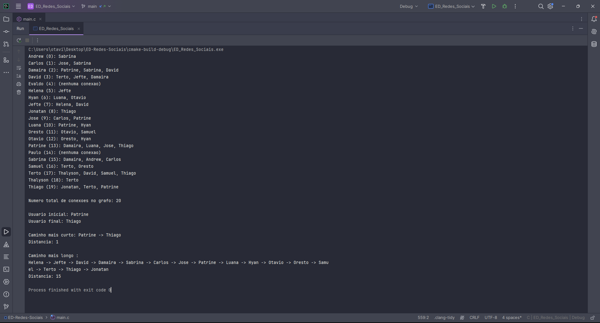

<h1>Navegação em Redes Sociais </h1>

<h2>Contexto</h2>

Em uma rede social, como Facebook ou LinkedIn, os usuários estão conectados por amizades ou conexões profissionais.

<h2>Atividade</h2>

Implemente um algoritmo em C que utilize BFS para encontrar o menor caminho (menor número de conexões) entre dois usuários. O programa deve receber como entrada a lista de conexões e os IDs dos dois usuários e imprimir as conexões entre eles.

<h2>Objetivo</h2>

Demonstrar como BFS pode ser utilizado para encontrar a menor distância em grafos não ponderados, aplicando conceitos de redes sociais.

<h2>Requisitos Mínimos</h2>
<ul>
  <li>Sua rede deve ter no mínimo 20 usuários;</li>
  <li>As conexões devem ser geradas aleatoriamente;</li>
  <li>É preciso tratar casos em que não há conexão;</li>
  <li>Imprimir a conexão mais próxima e mais distante entre dois usuários;</li>
</ul>

<h2>Descrição do Repositório</h2>

  O código principal do projeto, totalmente desenvolvido, está disponível na branch <code>main</code>, no arquivo <code>main.c</code>. Além disso, o repositório possui outras branches que detalham o processo de desenvolvimento do código e suas funcionalidades. As branches são:
  <ul>
    <li><code>1-etapa</code>: Contém a implementação inicial, que estabelece a estrutura básica do grafo e as funções essenciais.</li>
    <li><code>2-etapa</code>: Inclui a implementação do algoritmo BFS para encontrar o menor caminho entre dois usuários.</li>
    <li><code>3-etapa</code>: Adiciona funcionalidades para gerar conexões aleatórias e tratar casos em que não há conexão entre os usuários.</li>
    <li><code>4-etapa</code>: Finaliza o projeto com a impressão das conexões mais próximas e mais distantes entre os usuários.</li>
  </ul>

<h2>Resultado da Execução</h2>

  O resultado da execução do algoritmo BFS foi visualizado no site <a href="https://dreampuf.github.io/GraphvizOnline/" target="_blank">GraphvizOnline</a>. Abaixo está o trecho de código DOT que representa a saída gerada, que foi salva como <code>graphviz.png</code>.

<h3>Imagem da Saída no Console</h3>

<h3>Código DOT</h3>
<pre><code>
graph SocialNetwork {
    // Definindo os nós e suas conexões
    "Andrew" -- "Sabrina";
    "Carlos" -- "Jose";
    "Carlos" -- "Sabrina";
    "Damaira" -- "Patrine";
    "Damaira" -- "Sabrina";
    "Damaira" -- "David";
    "David" -- "Terto";
    "David" -- "Jefte";
    "David" -- "Damaira";
    "Evaldo" [style=dashed, color=gray]; // Nenhuma conexão
    "Helena" -- "Jefte";
    "Hyan" -- "Luana";
    "Hyan" -- "Otavio";
    "Jefte" -- "Helena";
    "Jefte" -- "David";
    "Jonatan" -- "Thiago";
    "Jose" -- "Carlos";
    "Jose" -- "Patrine";
    "Luana" -- "Patrine";
    "Luana" -- "Hyan";
    "Oresto" -- "Otavio";
    "Oresto" -- "Samuel";
    "Otavio" -- "Oresto";
    "Otavio" -- "Hyan";
    "Patrine" -- "Damaira";
    "Patrine" -- "Luana";
    "Patrine" -- "Jose";
    "Patrine" -- "Thiago";
    "Paulo" [style=dashed, color=gray]; // Nenhuma conexão
    "Sabrina" -- "Damaira";
    "Sabrina" -- "Andrew";
    "Sabrina" -- "Carlos";
    "Samuel" -- "Terto";
    "Samuel" -- "Oresto";
    "Terto" -- "Thalyson";
    "Terto" -- "David";
    "Terto" -- "Samuel";
    "Terto" -- "Thiago";
    "Thalyson" -- "Terto";
    "Thiago" -- "Jonatan";
    "Thiago" -- "Terto";
    "Thiago" -- "Patrine";

    // Estilo para destacar o caminho mais curto
    edge [color=red, penwidth=2.0];
    "Patrine" -- "Thiago";

    // Estilo para destacar o caminho mais longo
    edge [color=blue, penwidth=2.0, style=dashed];
    "Helena" -- "Jefte";
    "Jefte" -- "David";
    "David" -- "Damaira";
    "Damaira" -- "Sabrina";
    "Sabrina" -- "Carlos";
    "Carlos" -- "Jose";
    "Jose" -- "Patrine";
    "Patrine" -- "Luana";
    "Luana" -- "Hyan";
    "Hyan" -- "Otavio";
    "Otavio" -- "Oresto";
    "Oresto" -- "Samuel";
    "Samuel" -- "Terto";
    "Terto" -- "Thiago";
    "Thiago" -- "Jonatan";
}
</code></pre>

<h3>Imagem da Representação do Grafo</h3>

